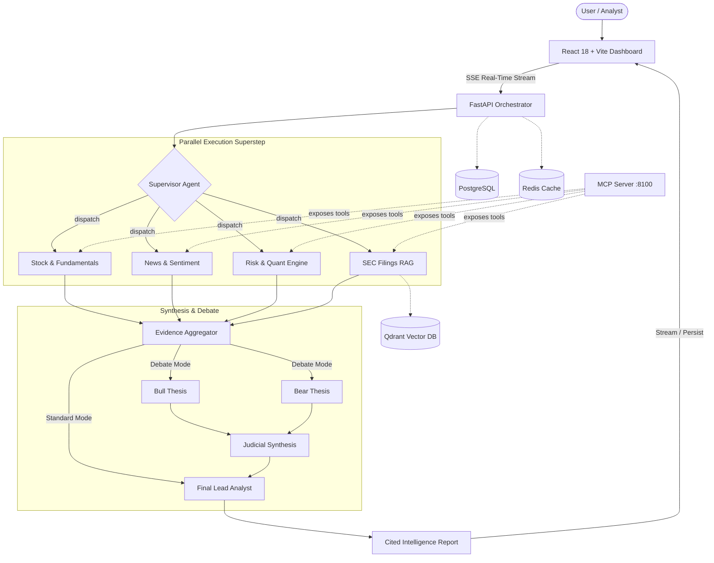

# AlphaLens — Multi-Agent Financial Intelligence Platform

[](https://python.org)
[](https://fastapi.tiangolo.com)
[](https://langchain.com)
[](https://react.dev)
[](https://www.typescriptlang.org/)
[](https://tailwindcss.com/)
[](https://www.docker.com/)
[](LICENSE)

**AlphaLens** is an enterprise-grade multi-agent financial research and portfolio intelligence platform. Powered by **LangGraph**, **Groq LLMs**, and a deterministic quantitative engine, it orchestrates a team of specialized agents to gather real-time market data, perform technical and fundamental analysis, search news sentiment, parse SEC EDGAR filings via RAG, and debate investment theses—synthesizing verifiable, citation-backed dossiers streamed live to a modern Neo-Fintech web interface.

---

## Key Capabilities

- **Parallel Multi-Agent Orchestration**: Built on LangGraph `StateGraph`. A Supervisor dynamically routes queries to specialized research agents that execute concurrently in a single superstep rather than sequential chains.
- **Zero-Hallucination Evidence Synthesis**: Every statement traces directly to verified market data (`yfinance` / `Alpha Vantage`), validated news coverage (`NewsAPI`), live SEC EDGAR 10-K/10-Q filing extracts, or deterministic Python calculations.
- **In-House SEC EDGAR RAG Pipeline**: Local vector embeddings (`sentence-transformers`) stored in Qdrant; retrieves and cites precise excerpts from actual corporate regulatory filings without relying on third-party vector APIs.
- **Deterministic Quantitative & Risk Engine**: Volatility, Sharpe / Sortino ratios, Maximum Drawdown, Value at Risk (VaR / CVaR), Monte Carlo simulation, and Mean-Variance portfolio optimization (`PyPortfolioOpt`) computed mathematically in Python—the LLM interprets the figures rather than calculating them.
- **Adversarial Bull vs. Bear Debate Engine**: Independent Bull and Bear agents construct competing theses strictly from the same retrieved evidentiary corpus, adjudicated by a neutral Judicial agent.
- **Native Model Context Protocol (MCP) Server**: Exposes the complete quantitative, research, and SEC filing toolset over the standard MCP specification for seamless integration into external AI clients (e.g., Claude Desktop).
- **Modern Neo-Fintech User Interface**: Bento-grid layout, real-time auto-scrolling stock ticker tape, interactive candlestick charts, technical indicators (SMA, RSI), and Plus Jakarta Sans typography.

---

## System Architecture



### Specialized Agents

| Agent | Responsibility | Data Sources & Tools |
|---|---|---|
| **Supervisor** | Intent classification, ticker extraction, parallel routing | Groq LLM |
| **Stock Analyst** | Valuation metrics, historical prices, ratios (P/E, EV/EBITDA, margins) | `yfinance`, Alpha Vantage |
| **News Analyst** | Real-time sentiment extraction, media coverage aggregation | NewsAPI, VADER, TextBlob |
| **Risk Analyst** | Deterministic metrics (Beta, Volatility, Max DD, VaR, CVaR, Monte Carlo) | NumPy, SciPy, Pandas, PyPortfolioOpt |
| **SEC Analyst** | Regulatory filings search (10-K, 10-Q), risk factors, accounting notes | SEC EDGAR API, Qdrant, Local Embeddings |
| **Bull & Bear** | Adversarial thesis construction grounded in discovered evidence | StateGraph parallel branch |
| **Final Analyst** | Executive synthesis, citation linking, final outlook & conviction | Cross-agent evidentiary aggregation |

---

## Tech Stack

| Layer | Technologies |
|---|---|
| **Multi-Agent Core** | LangGraph, LangChain, Groq API (`openai/gpt-oss-120b`, `llama-3.3-70b-versatile`) |
| **Backend API** | FastAPI, Pydantic v2, SQLAlchemy 2.0 (Async), Alembic, Uvicorn |
| **Frontend Web** | React 18, TypeScript, Vite, Tailwind CSS, Recharts, Lucide Icons |
| **Quantitative & Math** | Pandas, NumPy, SciPy, PyPortfolioOpt, VADER Sentiment, TextBlob |
| **RAG & Vector Search** | Sentence-Transformers (`all-MiniLM-L6-v2`), Qdrant Vector Database |
| **Integrations & MCP** | Model Context Protocol (MCP) SDK, SEC EDGAR API, yfinance, NewsAPI |
| **Infrastructure & Cache** | PostgreSQL 16, Redis 7, Docker & Docker Compose |

---

## Getting Started

### Prerequisites

- **Python 3.12+** and **Node.js 20+**
- A free [Groq API Key](https://console.groq.com/keys) *(required)*
- Docker Desktop *(optional, for containerized deployment)*

---

### Option A: Docker Compose (Recommended)

Run the full stack (Backend, Frontend, MCP Server, PostgreSQL, Redis, and Qdrant) with a single command:

1. **Clone the repository:**
   ```bash
   git clone https://github.com/Eya-Jmaa/AlphaLens.git
   cd AlphaLens
   ```

2. **Configure environment variables:**
   ```bash
   cp backend/.env.example backend/.env
   # Edit backend/.env and set GROQ_API_KEY=your_key_here
   ```

3. **Launch the entire stack:**
   ```bash
   docker compose --env-file backend/.env up --build
   ```

4. **Initialize database schema (first-time only):**
   ```bash
   docker compose exec backend alembic upgrade head
   ```

**Active Endpoints:**
- **Web Dashboard**: [http://localhost:8080](http://localhost:8080)
- **FastAPI Documentation**: [http://localhost:8000/api/docs](http://localhost:8000/api/docs)
- **MCP Server (Streamable HTTP)**: [http://localhost:8100](http://localhost:8100)

> [!NOTE]
> Docker ports on the host use non-colliding assignments (PostgreSQL `:5434`, Redis `:6380`, Qdrant `:6334`) so you won't experience port conflicts with existing local services.

---

### Option B: Local Development (Without Docker)

You can run the backend and frontend directly. In this mode, Redis, Qdrant, and PostgreSQL are optional—AlphaLens automatically degrades gracefully (in-memory caching, in-memory vector search, and direct report generation).

#### 1. Backend Setup

```bash
cd backend

# Create and activate virtual environment
python -m venv .venv
# On Windows:
.venv\Scripts\activate
# On Linux/macOS:
# source .venv/bin/activate

# Install dependencies
pip install -r requirements.txt

# Configure environment
cp .env.example .env
# Open .env and insert your GROQ_API_KEY

# Start backend server
uvicorn app.main:app --reload --port 8000
```

#### 2. Frontend Setup

In a new terminal:

```bash
cd frontend

# Install dependencies
npm install

# Start Vite development server
npm run dev
```

Visit [http://localhost:5173](http://localhost:5173) in your browser.

---

## Configuration Reference

Key variables configurable in `backend/.env`:

| Variable | Required | Default | Description |
|---|:---:|---|---|
| `GROQ_API_KEY` | **Yes** | — | API key from Groq Console |
| `GROQ_MODEL` | No | `openai/gpt-oss-120b` | Target inference model on Groq |
| `DATABASE_URL` | No | `postgresql+asyncpg://...` | Optional PostgreSQL for report and portfolio persistence |
| `REDIS_URL` | No | `redis://localhost:6379` | Optional Redis instance for market data and quote caching |
| `QDRANT_URL` | No | `http://localhost:6333` | Optional Qdrant instance (falls back to in-memory) |
| `FINANCIAL_DATA_API_KEY`| No | — | Optional Alpha Vantage key for supplementary metrics |
| `NEWS_API_KEY` | No | — | Optional NewsAPI key for broad media coverage |
| `SEC_USER_AGENT` | No | `AlphaLens (...)` | User agent header for SEC EDGAR regulatory compliance |

---

## API Reference

The FastAPI backend exposes interactive OpenAPI docs at `http://localhost:8000/api/docs`.

| Method | Endpoint | Description |
|---|---|---|
| `POST` | `/api/v1/analyze/stream` | Multi-agent research pipeline streamed via Server-Sent Events (SSE) |
| `POST` | `/api/v1/analyze/agent` | Direct non-streaming multi-agent analysis execution |
| `GET` | `/api/v1/reports` | Retrieve persisted research dossiers (requires database) |
| `GET` | `/api/v1/reports/{id}` | Fetch a complete dossier with agent traces and citations |
| `POST` | `/api/v1/portfolio/analyze` | Calculate portfolio risk metrics (VaR, Sharpe, Drawdown) |
| `POST` | `/api/v1/portfolio/optimize` | Compute Max-Sharpe or Min-Volatility portfolio allocations |
| `GET` | `/api/v1/market/{ticker}/chart` | Candlestick prices, RSI, and SMA time-series data |
| `GET` | `/api/v1/companies/{ticker}` | Comprehensive company fundamentals and overview |

---

## Model Context Protocol (MCP) Server

AlphaLens exposes its complete quantitative and research suite over the Model Context Protocol (MCP), enabling external agents (such as Claude Desktop or autonomous agents) to consume live market and regulatory tools directly:

```bash
# Run MCP server on port 8100
python -m mcp_server.server

# Run client smoke test
python mcp_server/check_client.py
```

### Exposed MCP Tools

- `get_stock_price` / `get_historical_prices` — Real-time and historical pricing series.
- `get_company_profile` / `get_financial_metrics` — Balance sheet, valuation, and income metrics.
- `search_news` — Live sentiment-scored financial headlines.
- `get_sec_filings` / `search_sec_documents` — Vector-indexed RAG over 10-K and 10-Q filings.
- `calculate_technical_indicators` — Deterministic SMA, EMA, RSI, and MACD series.
- `calculate_risk` / `calculate_portfolio_metrics` — Volatility, Sharpe, Drawdown, VaR/CVaR.
- `optimize_portfolio` — Quadratic programming allocation optimization.

---

## Testing & Evaluation

### Test Suites

```bash
cd backend

# Run fast unit and integration tests (mocked external calls)
pytest

# Run end-to-end tests against live market services
pytest -m slow

# Lint and style checks
ruff check app
```

### Evaluation Benchmark

AlphaLens includes an evaluation harness that tests agent routing accuracy, ticker resolution, citation validity, and output structure:

```bash
cd backend

# Run structural benchmark
python -m evaluation.runner

# Run evaluation with LLM judge quality scoring
python -m evaluation.runner --judge

# Test a specific case (e.g. Bull vs Bear debate)
python -m evaluation.runner --case bull_bear_debate
```

---

## Project Structure

```
AlphaLens/
├── backend/
│   ├── app/
│   │   ├── agents/          # Supervisor, Stock, News, Risk, SEC, Bull, Bear, Judge, Final
│   │   ├── api/             # FastAPI routers and dependency injection
│   │   ├── config/          # Application configuration and settings
│   │   ├── core/            # Logging, exceptions, and lifecycle handlers
│   │   ├── database/        # Async SQLAlchemy session management
│   │   ├── graph/           # LangGraph StateGraph, workflow routing, and state schema
│   │   ├── llm/             # Groq provider abstraction and client config
│   │   ├── models/          # Pydantic schemas and SQLAlchemy ORM models
│   │   ├── rag/             # Document chunking, local embeddings, and Qdrant retriever
│   │   ├── repositories/    # Database persistence layer
│   │   ├── services/        # External market, news, SEC, and cache clients
│   │   └── tools/           # Deterministic technical, financial, and quant calculations
│   ├── alembic/             # Database migrations
│   ├── evaluation/          # Benchmark dataset and evaluation runner
│   └── tests/               # Pytest suite
├── frontend/
│   ├── src/
│   │   ├── api/             # Typed API client and SSE streaming parser
│   │   ├── components/      # Bento dashboard, research desk, charts, and layout
│   │   ├── hooks/           # Custom React hooks (analysis stream, market hours)
│   │   └── types/           # TypeScript domain definitions
│   └── public/              # Static assets and favicon
├── mcp_server/              # Standalone Model Context Protocol server
├── docker-compose.yml       # Production orchestration stack
└── README.md
```

---

## License

This project is licensed under the [MIT License](LICENSE).
